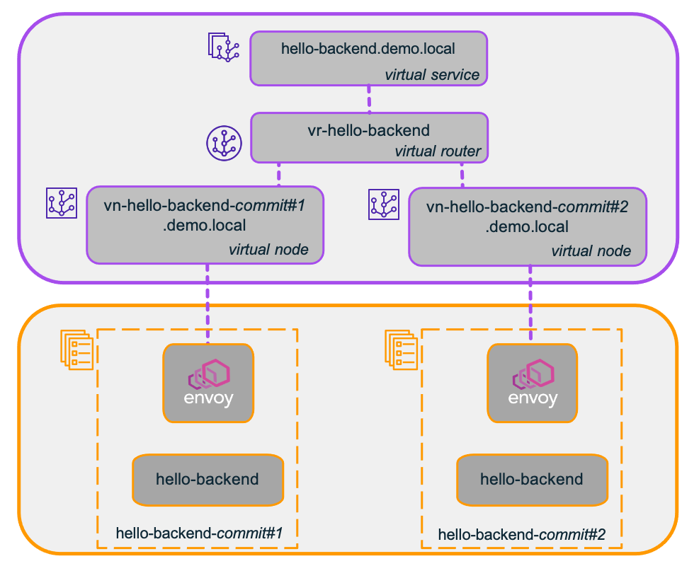
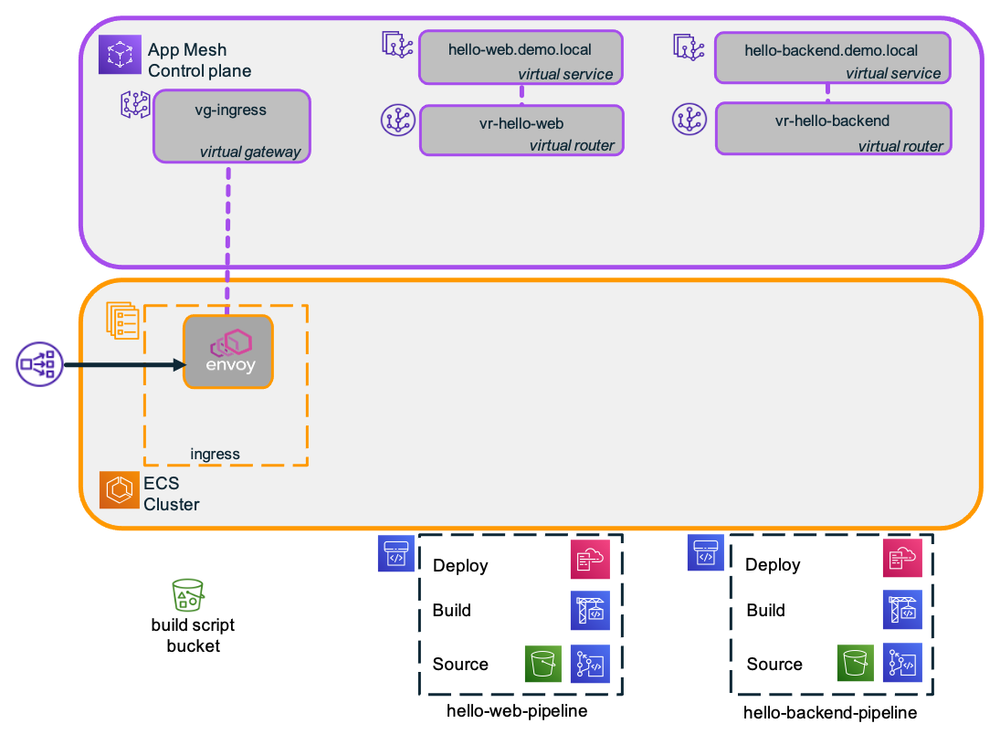

# ecs-pipeline-inject-envoy-sidecar

This code sample demonstrates how a service pipeline (which could form part of a broader GitOps pipeline) can be used to inject an Envoy sidecar container into Amazon ECS tasks for use with AWS App Mesh.

The benefits of this approach are that:
-	application developers do not need to be concerned with modifying task definitions to enable their use within the service mesh,
-	automation results in fewer errors, and
-	platform teams can use the pipeline to implement any conventions and/or enforce any policies that they have adopted in relation to meshed services, such as where logs are stored.

## Application Architecture

The sample uses AWS CloudFormation, the AWS Cloud Development Kit (CDK), and the AWS CLI to build an environment and service  pipelines for deploying a distributed `hello` application to Amazon ECS, with AWS App Mesh used to configure traffic routing.

### Sample application

The *hello* application consists of two services:
-	*hello-web* is a front-end service which receives HTTP GET requests on the resource path `/hello/<name>`. Upon receiving a request, it retrieves some data from the hello-backend service, using the resource path `/data`. It then uses this data, in combination with the passed *name* parameter, to construct an HTML response.
-	*hello-backend* is a service offering a REST API which responds to HTTP GET requests on the resource path `/data`, returning a JSON object comprising a greeting string and a message string.


The diagram above shows how the hello application would typically be deployed in an ECS environment without using a service mesh. In this example, the *hello-web* service is exposed via an application load balancer (which acts as the ingress), and the *hello-backend* service is discoverable using the DNS name `hello-backend.demo.local`. The solid arrows denote the flow of HTTP request traffic, which moves from left to right.


### Meshed service architecture

For the purposes of this sample, the *hello* application is deployed in an ECS environment with AWS App Mesh. The “meshified” application architecture is shown below.


In this architecture, additional resources are deployed in the ECS cluster itself, as well as in the App Mesh control plane. These are respectively depicted in the lower and upper halves of the architecture diagram. The dashed lines represent various associations between mesh components.

Users of the application send HTTP GET requests to an ingress load balancer with the path `/hello-service/hello/<name>`. The load balancer forwards these to an ingress proxy service, which routes them to the `hello-web` service with the path `hello/<name>`. This in turn invokes a `hello-backend` service with the path `/data` to retrieve a JSON object containing a greeting string and a message. `hello-web` uses this data, along with the supplied `<name>` to return an HTML page.

Communication between the service components is managed using AWS App Mesh. The ingress proxy service is represented by a virtual gateway, while `hello-web` and `hello-backend` are each represented by a virtual service.

The architecture allows for co-existence of multiple versions of a service, wherein each version is represented by a distinct virtual node. The service router is then configured to route traffic to one or more versions, making it possible to implement blue-green deployments, canary deployments and linear deployments through adjustment of the routing rules.

The diagram below shows an example in which there are two versions of the `hello-backend` service. Each version is idenitfied using the git *commitId* for the change that triggered the pipeline to deploy that version of the service. This identifier is used in both the virtual node name and the ECS service name.




## Service pipeline architecture

Service pipelines are used to deploy a new version of a service.
Each push to the pipeline's CodeCommit git repo results in the creation of a new stack, comprising a (meshified) ECS service and an accompanying App Mesh virtual node. Both the  service and the virtual node names incorporate the git *CommitId* so as to make them uniquely identifiable.


A separate service pipeline is created for each of the services `hello-web` and `hello-backend`. Each pipeline comprises three stages:
- **Source:** this comprises 2 actions:
  - a CodeCommit action triggered from a repo that is used for storing the service configuration in a single *manifest.yaml* file.
  - an S3 action associated with a *build script bucket* that contains a CDK build script used by the build stage.
- **Build:** a CodeBuild project that executes the CDK build script. This creates a CloudFormation template and parameter values for use by the *Deploy* stage.
- **Deploy:** uses CloudFormation to create a new service stack using the template and parameter values output by the *Build* stage.

Once a new service version has been deployed, the mesh routing can be modified to direct traffic to it. Older service version stacks can be deleted once they are no longer needed.

**Note:** The pipeline deliberately does *not* automatically create a virtual route to the new virtual node in the service pipeline's associated virtual route. This is left as a final deployment step. Reconfiguration of the service router can either be done manually (as done in this guide) or via another pipeline / automation e.g. a step funciton could be set up to perform a canary or linear deployment by altering the routing rules. This is beyond the scope of this code sample.

**Note:** For simplicity, the approach used in this sample assumes that a new stack is built for each new service version. A more elaborate pipeline architecture might also allow existing stacks to be updated, particularly where the changes are of a non-functional nature (such as changing auto-scaling parameters) and whenever it is deemed “safe” to apply an update to a live stack.

### Source stage: Service configuration repositories

A separate service configuration repo is used for each of the two microservices hello-web and hello-backend. Each repo contains a single *manifest.yaml* file that specifies a number of service configuration parameters. For example, the manifest file for the *hello-web* service is reproduced below:

```
Task:
  Family: "hello-web"
  Cpu: 256
  Memory: 512

AppContainer:
  Image: "wizriz/hello-web:66f2a19"
  Port: 80
  HealthCheckPath: "/ping"
  Command:
    - "node"
    - "server"
    - "-b http://hello-backend.demo.local/data"

VirtualNode:
  Backends:
    - "hello-backend.demo.local"
```

The *Task* section specifies the name to use for the ECS Task Definition family, and how much CPU and memory resources are required to run each task.

The *AppContainer* section specifies the container image to use, the port on which the application runs, the endpoint to use for checking the container’s health, and the command that should be executed when starting the container. In this case, the command runs the hello-web server, and passes the URI of the endpoint for the backend service that it should use.

Finally, the (optional) *VirtualNode* section specifies anu backends configuration which may be required for the virtual node associated with this service - which in this case aligns with the backend endpoint specified in the container command.

As can be seen from this example, the manifest file is not a complete specification of the parameters required to launch an ECS service. Additional parameters (such as auto-scaling parameters, where to store logs, or whether to use Fargate or EC2) are baked in to the pipeline itself, and are effectively determined by the team responsible for managing the platform. 

### Build and Deploy stages

The Build stage uses an AWS CodeBuild project to execute the CDK build script. The project makes available a number of environment variables for the CDK script to use, such as details of the VPC, ECS cluster, service discovery namespace, and log group to use. The build spec copies the manifest.yaml artifact from the ServiceConfig action into the CDK build script directory and then invokes cdk synth to build the stack template, as shown below:

```
version: 0.2
phases:
  install:
    runtime-versions:
      nodejs: 14.x
  build:
    commands:
      - cp $CODEBUILD_SRC_DIR_ConfigOutput/manifest.yaml ${CODEBUILD_SRC_DIR}/cdk-build-service
      - cd ${CODEBUILD_SRC_DIR}/cdk-build-service
      - npm install
      - npm run cdk synth
  post_build:
    commands:
      - echo Build completed on `date`
  artifacts:
    files:
      - cdk-build-service/cdk.out/CdkBuildServiceStack.template.json
```

The CDK build script broadly proceeds as follows:
1.	Check for presence of required environment variables.
2.	Read and validate the *manifest.yaml*.
3.	Create a virtual node for the new version of the service.
4.	Create a Fargate task definition for the new version of the service, adding both an application container, and an Envoy proxy sidecar container.
5.	Create an ECS Service for the new version of the service.
6.	Output a CloudFormation template.

The Deploy stage then applies the resulting CloudFormation template to create a stack for the new version of the service. The *commitId* from the CodeCommit source is embedded in the stack name.


# Walkthrough

The steps required to set up and run the demo application are as follows:
1.	Create a mesh environment, including a VPC, ECS Cluster, and App Mesh with a public-facing ingress.
2.	For each of the two microservices, create a virtual service, virtual router, and service pipeline.
3.	Configure and deploy the services using the service pipelines.
4.	Configure mesh routing to use the deployed services.
5.	Test application.

The following steps can subsequently be used to demonstrate the introduction of a new service version with a canary deployment strategy:

6.	Make a change to the hello-backend service configuration and push to deploy new version.
7.	Adjust service routing for hello-backend to enable canary testing (10% to new, 90% to old), and re-test.
8.	Move all traffic to new version, and re-test.
9.	Delete service stack for old version.


## Pre-requisites

To build this demo, you will need:
* Access to AWS account with suitable permissions. **Note:** For experimental purposes you can use `Administrator` permissions, but this should not be done in production solutions.
* Access to the following tools:
  * bash
  * AWS CLI
  * git (set up for use with CodeCommit)
  * curl
  * docker (optional - only required if you want to build the application images yourself to avoid dockerhub throttling)
An easy way to satisfy the tools requirement is to use AWS Cloud9. All tools are pre-installed, wtih the exception of `jq` which can be installed with `sudo yum install jq`.

## Clone this repo

Working in a suitable directory, clone the code sample repo as follows:
```
git clone https://github.com/aws-samples/ecs-pipeline-inject-envoy-sidecar.git
```
## Set the INSTALL_DIR

For easy reference, set the variable INSTALL_DIR to wherever you clone this repo.
```
INSTALL_DIR=<path-to-local-repo>
cd $INSTALL_DIR
```

## Step 1: Create mesh environment

Create a mesh environment using the supplied template as shown below.
```
aws cloudformation deploy \
  --stack-name demo-env \
  --template-file cfn/Mesh-Environment.yaml \
  --parameter-overrides "EnvironmentName=demo" \
  --capabilities CAPABILITY_IAM
```

This stack creates an environment comprising:
- a VPC with 2 public subnets and 2 private subnets with NAT Gateways,
- an ECS cluster (no container instances are created, as AWS Fargate will be used to run all services)
- a service discovery namespace
- a log group
- an App Mesh service mesh
- an ingress service in ECS (Envoy proxy), fronted by a network load balancer, and with an associated virtual gateway in the mesh.


Following completion of this stack build, you will have an environment as shown below:


## Step 2: Create the virtual services, virtual routers, and service pipelines

With the mesh environment in place you can now build the virtual services, virtual routers, and service pipelines.

### Step 2.1: Prepare build script bucket

The build script bucket is shared with all service pipelines, so you need to build this first. Create it using the supplied CloudFormation template.
```
aws cloudformation deploy \
  --stack-name demo-build-script-bucket \
  --template-file cfn/Build-Script-Bucket.yaml \
  --parameter-overrides "EnvironmentName=demo"
```

The service build script files are in $INSTALL_DIR/cdk-build-service. Zip and upload them to the bucket as follows:
```
cd $INSTALL_DIR
zip -r cdk-build-service.zip cdk-build-service/*
build_script_bucket=$(aws cloudformation describe-stacks \
  --stack-name demo-build-script-bucket \
  --query "Stacks[0].Outputs[?OutputKey=='BuildScriptBucketName'].OutputValue" \
  --output text \
)
aws s3 cp cdk-build-service.zip s3://$build_script_bucket
```

### Step 2.2: Create virtual services and service pipelines from a common template

The file `cfn/Service-Pipeline.yaml`  contains a template for creating a service pipeline, along with a virtual service and virtual router, for a service. You can use this to create a pipeline, virtual service and virtual router for each of `hello-web` and `hello-backend` services. These stacks can be created simultaneously as follows:
```
cd $INSTALL_DIR
aws cloudformation deploy \
  --stack-name hello-web-pipeline \
  --template-file cfn/Service-Pipeline.yaml \
  --parameter-overrides "EnvironmentName=demo" "ServiceName=hello-web" \
  --capabilities CAPABILITY_IAM &
aws cloudformation deploy \
  --stack-name hello-backend-pipeline \
  --template-file cfn/Service-Pipeline.yaml \
  --parameter-overrides "EnvironmentName=demo" "ServiceName=hello-backend" \
  --capabilities CAPABILITY_IAM
```

Once deployed, you can use the AWS CodePipeline console to see a visualization of each pipeline. You will see that both are in a failed state. The reason for this is that the source CodeCommit repos are still empty, and the CodeCommit source action therefore fails. This will be rectified as soon as you push service configuration files to the repos.

Following completion of these stack builds, your set up will be as shown below:



## Step 3: Deploy services using the pipelines

To create services via the pipelines you  need to push service configuration files into the CodeCommit repos for each service.

You also need to have application images for the containers in place. The supplied configuration files default to pre-built images on *dockerhub*, but optionally you can build them yourself and store them in ECR.

First, create a directory for working with local git repos and other temporary files e.g. in `~/demo-workdir`:
```
WORK_DIR=~/demo-workdir
mkdir $WORK_DIR
```

### Step 3.1: (Optional) Build container images and store in ECR

The supplied `manifest.yaml` files reference pre-built images for `hello-web` and `hello-backend` that are hosted in *dockerhub*, and these can be used directly (subject to any dockerhub throttling limits that may apply). If you are happy to use the dockerhub images you can skip this section.

If you prefer to host the images in your own ECR repository, you can follow this section to build the application container images yourself. You will need to have *docker* installed as a pre-requisite.

To build the images for use with ECR, first clone the application git repo:
```
cd $WORK_DIR
git clone https://github.com/rizblie/docker-tiered-hello.git
cd docker-tiered-hello
```

Get *docker* to log in to ECR:
```
$(aws ecr get-login --no-include-email)
```

Build and push the `hello-web` image:
```
cd hello-web
web_ecr_uri=$( \
    aws ecr create-repository \
        --repository-name hello-web \
        --query repository.repositoryUri \
        --output text \
)
docker build -t hello-web:v1 .
docker tag hello-web:v1 $web_ecr_uri:v1
docker push $web_ecr_uri:v1
```

Build and push the `hello-backend` image:
```
cd ../hello-backend
backend_ecr_uri=$( \
    aws ecr create-repository \
        --repository-name hello-backend \
        --query repository.repositoryUri \
        --output text \
)
docker build -t hello-backend:latest .
docker tag hello-backend:v1 $backend_ecr_uri:v1
docker push $backend_ecr_uri:v1
```

Verify that your container images are in your ECR registry:

```
aws ecr list-images --repository-name hello-web
aws ecr list-images --repository-name hello-backend
```

### Step 3.2: Deploy services

To trigger the *hello-web* service pipeline you need to push a service configuration into the associated CodeCommit repository.

First, set up the git credential helper for CodeCommit as follows:
```
git config --global credential.helper '!aws codecommit credential-helper $@'
git config --global credential.UseHttpPath true
```
For more info on the credential helper, please refer to the [documentation](https://docs.aws.amazon.com/codecommit/latest/userguide/setting-up-https-unixes.html).

If not done yet, configure your git username and email address:
```
git config --global user.name "Your Name"
git config --global user.email you@example.com
```

Clone the service git repo for *hello-web* and copy in the supplied service configuration files:
```
web_repo_url=$(aws cloudformation describe-stacks \
  --stack-name hello-web-pipeline \
  --query "Stacks[0].Outputs[?OutputKey=='SourceRepoCloneUrlHttp'].OutputValue" \
  --output text \
)
cd $WORK_DIR
git clone $web_repo_url
cd hello-web-cfg
cp $INSTALL_DIR/svc/hello-web-cfg/* .
```

The service configuration is set up to pull the application container image
from *dockerhub* by default. If you are using ECR then edit `manifest.yaml` and replace the *AppContainer.Image* name with the output of:

```
echo $web_ecr_uri:v1
```

You can now push the service configuration as follows:
```
git add .
git commit -m "Baseline service configuration"
git push
```

This triggers the service pipeline for *hello-web*. You can monitor the progress of the pipeline using the AWS CodePipeline console.

Repeat the same steps for the `hello-backend` service. Start by cloning the git repo from the `hello-backend` service pipeline and copy the supplied manifest file:
```
backend_repo_url=$(aws cloudformation describe-stacks \
  --stack-name hello-backend-pipeline \
  --query "Stacks[0].Outputs[?OutputKey=='SourceRepoCloneUrlHttp'].OutputValue" \
  --output text \
)
cd $WORK_DIR
git clone $backend_repo_url
cd hello-backend-cfg
cp $INSTALL_DIR/svc/hello-backend-cfg/* .
```

The service configuration is set up to pull the application container image
from *dockerhub* by default. If you are using ECR then edit `manifest.yaml` and replace the *AppContainer.Image* image  with the output of:

```
echo $backend_ecr_uri:v1
```

Push the service configurarion as follows:
```
git add .
git commit -m "Baseline service configuration"
git push
```


### Step 3.3: Wait for service deployment to complete

Monitor the deployment of the services via the AWS CodePipeline console, and wait until they are up and running (you can use the ECS console to do this).

Following completion of these service deployments, your set up will now be as shown below:


Note that there is no connection between the virtual routers and the virtual nodes, because routes have not been set up yet!

## Step 4: Configure mesh routing

At this point the ECS cluster is running three ECS services: the *ingress* service, the *hello-web* service, and the *hello-backend* service. There are also corresponding resources in the mesh control plane, but routing has not yet been set up.

## Step 4.1: Configure virtual gateway routing

The *ingress* service is associated with a virtual gateway (*vg-ingress*) in the mesh. This needs to be configured to route traffic to the *hello-web.demo.local* virtual service.

```
cd $WORK_DIR
cat <<EoF >r-ingress-hello-service.json
{
  "httpRoute": {
    "action": {
      "target": {
        "virtualService": {
          "virtualServiceName": "hello-web.demo.local"
        }
      }
    },
    "match": {
      "prefix": "/hello-service"
    }
  }
}
EoF
aws appmesh create-gateway-route \
  --mesh-name demo \
  --virtual-gateway-name vg-ingress \
  --gateway-route-name r-ingress-hello-service \
  --spec file://r-ingress-hello-service.json
```

## Step 4.2: Configure virtual service routing

The ECS services deployed for the *hello-web* service and the *hello-backend* service each have an associated virtual node (representing a specific version of the service) in the mesh.  However, the virtual services and virtual routers created for the services are not yet connected to the virtual nodes.

As this is a first deployment of each of these services i.e. there is no prior version, you can set up routing so that 100% of traffic for each service is routed to the sole virtual node that exists for each service. Later, you can set up routing for canary deployment to transition from an old version to a new version.

To set up routing for these services, first use the git *CommitId* to identify the virtual nodes created by the service pipelines:
```
web_commit_id=$(git ls-remote $web_repo_url HEAD | cut -f 1 | cut -b 1-8)
web_vn=vn-hello-web-$web_commit_id
backend_commit_id=$(git ls-remote $backend_repo_url HEAD | cut -f 1 | cut -b 1-8 )
backend_vn=vn-hello-backend-$backend_commit_id
```

Set up route for the *hello-web* service:
```
cat <<EoF >r-hello-web.json
{
  "httpRoute": {
    "action": {
      "weightedTargets": [
        {
          "virtualNode": "$web_vn",
          "weight": 100
        }
      ]
    },
    "match": {
      "method": "GET",
      "prefix": "/"
    }
  },
  "priority": 1
}
EoF
aws appmesh create-route \
  --mesh-name demo \
  --virtual-router-name vr-hello-web \
  --route-name r-hello-web \
  --spec file://r-hello-web.json
```


Set up route for the *hello-backend* service:
```
cat <<EoF >r-hello-backend.json
{
  "httpRoute": {
    "action": {
      "weightedTargets": [
        {
          "virtualNode": "$backend_vn",
          "weight": 100
        }
      ]
    },
    "match": {
      "method": "GET",
      "prefix": "/"
    }
  },
  "priority": 1
}
EoF
aws appmesh create-route \
  --mesh-name demo \
  --virtual-router-name vr-hello-backend \
  --route-name r-hello-backend \
  --spec file://r-hello-backend.json
```

## Step 5: Test the application

Obtain the URL for the load balancer:
```
ingress_url=$(aws cloudformation describe-stacks \
  --stack-name demo-env \
  --query "Stacks[0].Outputs[?OutputKey=='IngressEndpoint'].OutputValue" \
  --output text \
)
```

Use `curl` to test:
```
curl $ingress_url/hello-service/hello/Bob
```

You should see something like:
```
Hello Bob<br>Welcome to our world!<br><br>timestamp: 1619709367722
```

Congratulations, at this point you have a working meshed application!

The remainder of this walkthrough shows how you can deploy a new version of the *hello-backend* service alongside the existing version, and then set up canary routing.

## Step 6: Deploy a new version of the backend service configuration

Switch to the local repo for the backend service configuration:
```
cd $WORK_DIR/hello-backend-cfg
```

Edit `manifest.yaml` to change the `AppContainer.Command` parameters that control the data that is returned by the backend service. For example: 

```
Task:
  Family: "hello-backend"
  Cpu: 256
  Memory: 512

AppContainer:
  Port: 80
  Image: "wizriz/hello-backend:66f2a19"
  HealthCheckPath: "/ping"
  Command:
    - "node"
    - "server"
    - "-g Yo"
    - "-m Have a great day!"
```


Commit and push the service configuration change to trigger the service pipeline:
```
git add .
git commit -m "Changed greeting"
git push
```

Retrieve and store the latest commit id:
```
new_backend_commit_id=$(git log --format="%H" -n 1)
echo $new_backend_commit_id
```

Wait for the new version of the service to be deloyed. You can do this by monitoring the AWS CodePipeline console.

Once this reaches the deploy stage, you can check the status of the CloudFormation stack deployment via the CloudFormation console, or the CLI using:
```
aws cloudformation describe-stacks --stack-name demo-hello-backend-$new_backend_commit_id
```
**Note:** If you get a "Stack with id ... does not exist" error, then verify that the *hello-backend* pipeline is in the deployment stage and try again.


## Step 7: Canary testing

Once the new version of the service has been deployed, you should see two stacks that start with the name *demo-hello-backend*, one for each version as denoted by the respective git *commitId*. You can verify this using:

```
aws cloudformation describe-stacks \
  --query 'Stacks[?starts_with(StackName,`demo-hello-backend`)].StackName'
```

You can now modify the virtual router for the *hello-backend* service to enable canary testing of the new version.

### Step 7.1: Adjust routing

Change the routing for the *hello-backend* virtual service so that 10% of the traffic is sent to the new version.

First, identify the virtual node associated with the new version:

```
new_backend_vn=vn-hello-backend-$new_backend_commit_id
```

Next, update the route for the *hello-backend* service to send 10% of requests to the new version, and 90% to the old version:
```
cd $WORK_DIR
cat <<EoF >r-hello-backend-2.json
{
  "httpRoute": {
    "action": {
      "weightedTargets": [
        {
          "virtualNode": "$backend_vn",
          "weight": 90
        },
        {
          "virtualNode": "$new_backend_vn",
          "weight": 10
        }        
      ]
    },
    "match": {
      "method": "GET",
      "prefix": "/"
    }
  },
  "priority": 1
}
EoF
aws appmesh update-route \
  --mesh-name demo \
  --virtual-router-name vr-hello-backend \
  --route-name r-hello-backend \
  --spec file://r-hello-backend-2.json
```


### Step 7.2: Test canary

Repeatedly use `curl` to access the URL:
```
while sleep 1; do curl $ingress_url/hello-service/hello/Bob ; echo ""; done
```
You should see that 1 in 10 responses have the new greeting and message. Hit *Ctrl-C* when done.


## Step 8: Adjust routing to switch to new version, and re-test

To switch 100% of the traffic to the new version, adjust the routing again:

```
cd $WORK_DIR
cat <<EoF >r-hello-backend-3.json
{
  "httpRoute": {
    "action": {
      "weightedTargets": [
        {
          "virtualNode": "$new_backend_vn",
          "weight": 100
        }        
      ]
    },
    "match": {
      "method": "GET",
      "prefix": "/"
    }
  },
  "priority": 1
}
EoF
aws appmesh update-route \
  --mesh-name demo \
  --virtual-router-name vr-hello-backend \
  --route-name r-hello-backend \
  --spec file://r-hello-backend-3.json
```

Test by repeatedly using curl to access the URL:

```
while sleep 1; do curl $ingress_url/hello-service/hello/Bob ; echo ""; done
```

You should now see that all responses have the new greeting and message. Hit *Ctrl-C* when done.

## Step 9: Delete old version

You can keep the old version of the service running for as long as needed, so that you can roll back to it (by modifying the routing) if needed. Once you are satisfied that you no longer need it, you can delete the entire stack for that version to clean up all associated resources, including the virtual node.

```
aws cloudformation delete-stack --stack-name demo-hello-backend-$backend_commit_id
```


# Cleanup

To avoid any unexpected charges, don’t forget to clean up resources once you have finished experimenting with the demo application! 

## Delete mesh routes

Clean up virtual service routes:
```
aws appmesh delete-route \
  --mesh-name demo \
  --virtual-router-name vr-hello-web \
  --route-name r-hello-web
aws appmesh delete-route \
  --mesh-name demo \
  --virtual-router-name vr-hello-backend \
  --route-name r-hello-backend
```

Clean up ingress route:
```
aws appmesh delete-gateway-route \
  --mesh-name demo \
  --virtual-gateway-name vg-ingress \
  --gateway-route-name r-ingress-hello-service
```

## Delete service stacks

Next, delete the service stacks using:
```
aws cloudformation describe-stacks \
  --query 'Stacks[?starts_with(StackName,`demo-hello-`)].StackName' \
  --output text \
| xargs -n1 aws cloudformation delete-stack --stack-name
```

Alternatively, you can use the CloudFormation console.

It is important to do this *before* deleting the pipeline stacks, as service stack deletion requires the CloudFormation IAM service roles that are part of the pipeline stacks.

## Delete virtual services, virtual routers, and pipeline stacks

Wait until all service stack deletions have completed. Once done, you can delete the pipeline stacks using:
```
aws cloudformation delete-stack --stack-name hello-web-pipeline
aws cloudformation delete-stack --stack-name hello-backend-pipeline
```

**Warning:** Do not delete these pipeline stacks until all service stacks have been deleted. If you accidentally delete the pipeline stacks before any of the service stacks you will need to re-create the pipeline CloudFormation IAM role in order to delete any service stacks.

## Delete build script bucket

Once the pipeline stacks have been deleted, you can delete the build script bucket using:
```
build_script_bucket=$(aws cloudformation describe-stacks \
  --stack-name demo-build-script-bucket \
  --query "Stacks[0].Outputs[?OutputKey=='BuildScriptBucketName'].OutputValue" \
  --output text \
)
aws s3api list-object-versions \
  --bucket $build_script_bucket \
  --prefix cdk-build-service.zip \
  --query "[Versions[*].VersionId,DeleteMarkers[*].VersionId]" \
  --output text \
| xargs -n1 aws s3api delete-object \
  --bucket $build_script_bucket \
  --key cdk-build-service.zip \
  --version-id
aws cloudformation delete-stack --stack-name demo-build-script-bucket
```

## Delete ECR repositories (if you used ECR)

If you used ECR to host your own container images, you can delete them using:
```
aws ecr delete-repository --force --repository-name hello-web
aws ecr delete-repository --force --repository-name hello-backend
```

## Delete mesh environment

Delete the mesh environment:
```
aws cloudformation delete-stack --stack-name demo-env
```
